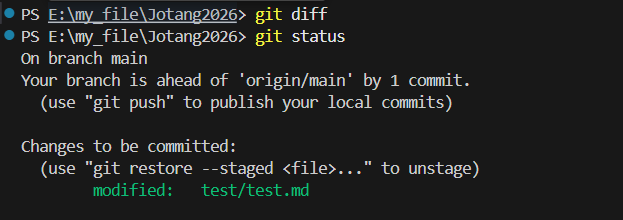
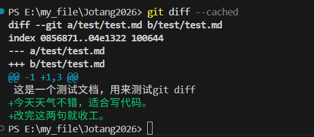
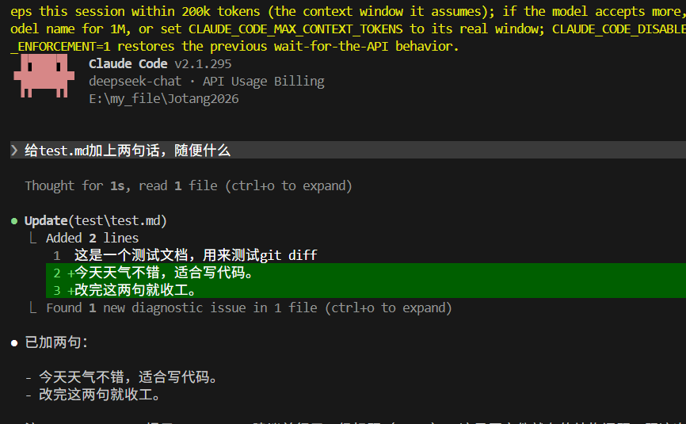

## task1

看了一下我有的agent

选择Claude进行尝试

*我连接的是deepseek的API，找到.claude文件创建一个settings.json配置一下就可以了*

我给它了一些小任务

1.读取仓库文件

2.生成一个`.md`文件:

3.修改已有文件

然后使用`git diff`就没有任何输出

询问ai之后说，我修改修改的commit到了幸存区，所以要使用`git diff --cached`

这样就可以看到agent对我们文件做的修改
和我要求的一样的

---

## task2

### 1. Agent 为什么能够读取文件、修改代码，而普通聊天 AI 通常不能？
- 普通聊天AI只能使用平时训练记住的知识，以及对话框你上传的文件和输入的文字信息等，它相当于被隔绝在一个独立的内部环境，给它什么它就只能拿这些材料进行思考更改生成
- Agent有一套Tool工具应用于终端，不仅可以思考，还可以感知外部环境（比如执行ls查看文件夹里有什么，用cat读取某个代码文件的内容），甚至可以改变外部环境（比如sed命令修改代码，或者用git提交代码）

### 2. Tool 在 Agent 中起到了什么作用？
- AI本身只能输出文字图片等，Tool赋予了Agent感知和改变外界的能力，让AI大脑可以做出实际操作
- Tool给了大模型以下能力：
  - 信息获取工具：读取文件、搜索网页、查询数据库
  - 代码执行工具：在终端里运行命令、编译代码、运行测试
  - 文件操作工具：修改代码、新建文件、删除文件
  
### 3. 为什么项目需要给 Agent 配置一份类似“员工手册”的规则？
- 配置规则是为了降低沟通成本，对齐上下文，保证代码规范来提升效率
  - 对齐上下文：项目千差万别，每个项目架构都不一样，Agent不会自动了解项目，一份“员工手册”能告诉它项目的技术栈、目录结构、依赖关系，让它快速了解项目
  - 降低沟通成本：如果每次都要把“本项目使用C++17，代码缩进必须4个空格，修改代码后必须运行单元测试”这些话重复一遍，会非常的低效，把这些固定规则写进手册，Agent 每次启动都会自动遵守，省去了重复说明
  - 保证代码规范：它能让AI生成的代码风格、注释要求、提交规范等与团队保持一致，避免它自己乱改一通，完全不符合规范

### 4. Agent 为什么可能“忘记”之前说过的内容？Agent 的额度怎么计算？
- 为什么会忘记：大语言模型有上下文记忆窗口的限制，相当于AI的短期记忆容量，如果对话太长，或者读取的文件内容太多，超出了这个容量上限，最早的内容就会被挤出去，如果Agent重新启动（开启了新会话），之前的短期记忆也会被清空，这是为了防止占用太多内存保证效率

- 额度怎么计算：通常按Token词元（把文字内容分词后转化为数字向量）计算，发给AI的内容、AI读取的文件、AI回答的内容，都会被转换成Token，一般都是（输入Token数+输出Token数）×单价，所以上下文越长、读取的文件越多，消耗的Token和费用就越高
  

### 5. 如果一个 Agent 可以随便执行任何终端命令，会有什么风险？
- 会有很大的风险，因为AI可以在终端随心所欲，很容易做出一些不可逆的错误操作
  - 误删数据：理解错误直接强制删除一些重要文件和数据
  - 泄露机密：把API或者个人隐私信息发到外部网络
  - 恶意攻击：黑客连接了Agent，就可以通过其对电脑进行攻击植入木马病毒等
- 所以现在的Agent在执行终端操作的时候通常都会征求用户同意授权，或者利用沙盒将其与真正终端隔离开