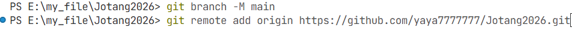
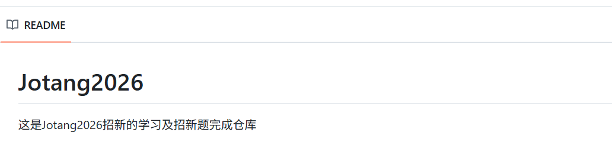
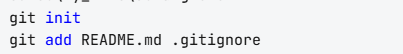
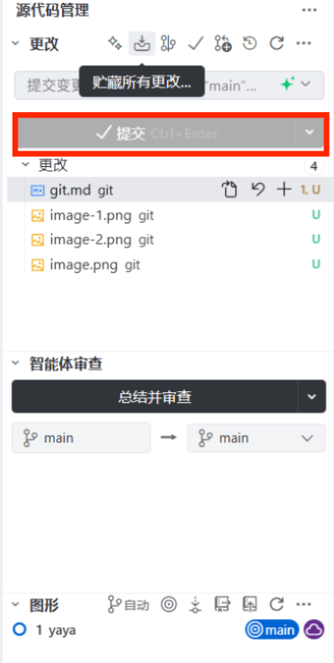
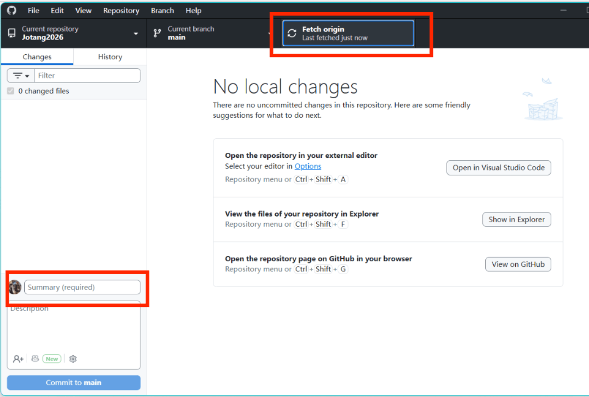
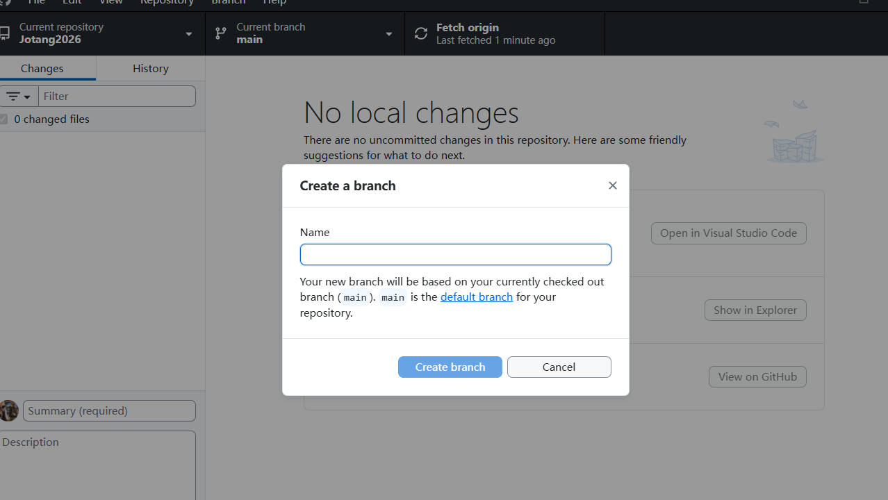
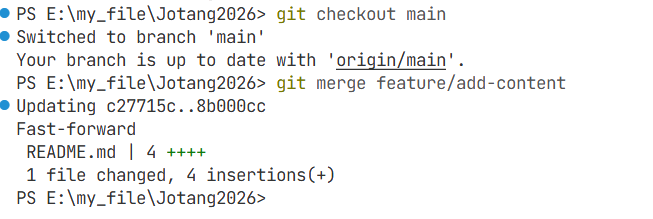

先在本地创建一个仓库Jotang2026

然后在GitHub上创建一个仓库Jotang2026
在本地仓库Jotang2026中添加远程仓库Jotang2026



写一个README.md文件对仓库用法进行说明


写一个.gitignore文件忽略配置文件


推送内容到远程仓库


也可以使用GIT命令推送内容到远程仓库
```
git push -u origin main
```

还可以使用desktop客户端推送内容到远程仓库


然后可以新建一个分支new


也可以合并分支


回退到上一个版本
```
git reset --hard HEAD~1
```